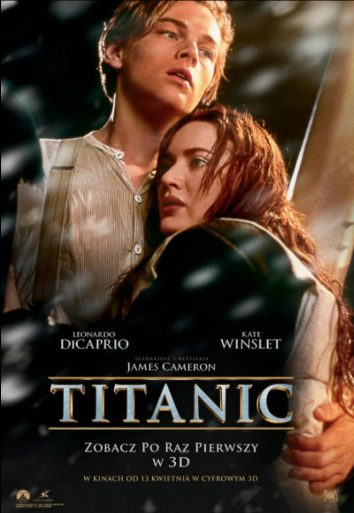

# Projekt3GDSW

# Moje TOP 5:
## `Filmów`  
## `Seriali`
## `Ksi¹¿ek`

---
# ` Moje TOP 5 filmów `

##   `1.Harry Potter i Wiêzieñ Azkabanu`
### `Harry Potter i jego najlepsi przyjaciele Ron i Hermiona, po przerwie letniej powracaj¹ do Hogwartu, aby rozpocz¹æ trzeci rok nauki. W tym samym czasie z pilnie strze¿onego wiêzienia dla czarodziejów ucieka niebezpieczny przestêpca - Syriusz Black! Wszystko wskazuje na to, ¿e Black poluje na Harry'ego. Ca³y œwiat czarodziejów rozpoczyna poszukiwania zbiega; z Azkabanu zostaj¹ wys³ane przera¿aj¹ce istoty - Dementorzy, w celu zabicia przestêpcy... Film "Harry Potter i wiêzieñ Azkabanu" to trzecia z kolei ekranizacja powieœci J.K. Rowling.`
***
##   `2. Titanic`
###  W s³oneczny, kwietniowy dzieñ w 1912 roku, na angielskim wybrze¿u arystokratyczna rodzina wraz z 17-letni¹ Rose (Kate Winslet) wchodzi na pok³ad Titanica, udaj¹c siê w podró¿ do Stanów Zjednoczonych.Pó³ godziny póŸniej graj¹cy w pokera w tanim, portowym barze 23-letni Jack Dawson (Leonardo DiCaprio) wygrywa szczêœliwym trafem bilet III klasy na rejs Titanikiem. W ostatniej chwili przed wyp³yniêciem statku wbiega na jego pok³ad. Tak zaczyna siê wielka historia mi³osna, która ma odmieniæ ¿ycie piêknej, bogatej, lecz nieszczêœliwej Rose oraz biednego, nie maj¹cego nic prócz talentu malarskiego, Jacka.Grupa "poszukiwaczy skarbów" pod wodz¹ Brocka Lovetta (Bill Paxton) przeszukuje wrak "Titanica" w nadziei na odnalezienie bezcennego diamentu zwanego "sercem oceanu". Pewnego dnia natrafia na kasetê pancern¹ z rysunkiem przedstawiaj¹cym m³od¹ dziewczynê z diamentem na szyi. T¹ dziewczyn¹ okazuje siê Rose Calvert (Gloria Stuart), która zgadza siê opowiedzieæ o wydarzeniach zwi¹zanych z katastrof¹ "Titanica". 10 kwietnia 1912, Southampton, Anglia. Siedemnastoletnia Rose DeWitt Bukater (Kate Winslet) wsiada na pok³ad Titanica, najwspanialszego transatlantyku œwiata. W podró¿y do rodzinnej Filadelfii towarzyszy jej snobistyczna matka, Ruth (Frances Fisher) oraz narzeczony Caledon Hockley (Billy Zane), cz³owiek arogancki i dumny ze swojego bogactwa. Rose czuje siê g³êboko nieszczêœliwa. W napadzie desperacji decyduje siê zakoñczyæ ¿ycie skacz¹c do lodowato zimnej wody. W ostatniej chwili jej samobójcz¹ próbê udaremnia Jack Dawson (Leonardo DiCaprio), pasa¿er z trzeciej klasy. Okazuje siê, ¿e Jack to prawdziwy "niespokojny duch", a przy tym utalentowany rysownik. Rose jest nim oczarowana, uœwiadamia sobie, ¿e uda³o mu siê osi¹gn¹æ w ¿yciu wszystko to, co dla niej pozostanie na zawsze nieziszczalnym marzeniem. To pocz¹tek zakazanej mi³oœci, w nieodpowiednim miejscu i w nieodpowiednim czasie.
***
##   `3. Król Lew`
### "Król Lew" to opowieœæ o dorastaniu, przyjaŸni, mi³oœci, ale tak¿e "krêgu ¿ycia" - ktoœ umiera, by ktoœ móg³ ¿yæ. Simba jako ma³e lwi¹tko zostaje pos¹dzony o œmieræ swego ojca Mufasy. Wystraszony ucieka z Lwiej Ska³y, goniony przez hieny swego stryja Skazy. Simba trafia do d¿ungli, gdzie opiekuj¹ siê nim surykatka Timon i guziec Pumba. Z czasem ³¹czy ich wielka przyjaŸñ, Simba zapomina o swoim pochodzeniu do czasu, gdy Nala, przyjació³ka z m³odzieñczych lat przypadkiem go odnajduje i opowiada o zniszczonej, Ÿle rz¹dzonej ojczyŸnie... Simba wraca, by pomœciæ Mufasê i odzyskaæ Lwi¹ Ska³ê.
***
##   `4. Szarada`
###  Regina Lambert (Audrey Hepburn) spêdza czas w górach z przyjació³k¹, której zwierza siê, ¿e ma zamiar rozwieœæ siê z mê¿em. Po powrocie do Pary¿a zastaje mieszkanie kompletnie opustosza³e oraz wiadomoœæ, ¿e zamordowano jej mê¿a. Regina dowiaduje siê równie¿, ¿e by³ on zamieszany w kradzie¿ 250 tysiêcy dolarów, których poszukuj¹ teraz jego dawni wspólnicy oraz CIA. Jej ¿ycie jest w niebezpieczeñstwie, a Peter Joshua (Cary Grant), któremu zaufa³a, okazuje siê zupe³nie kimœ innym. Reggie - m³oda, elegancka dama, wraca do domu z wypoczynku w Alpach. Na miejscu dowiaduje siê o œmierci mê¿a, który zosta³ wypchniêty z poci¹gu. Policja znajduje przy nim cztery paszporty na ró¿ne nazwiska. Ma³o tego - w mieszkaniu zosta³y go³e œciany, a w ambasadzie amerykañskiej informuj¹ Reggie, ¿e nie powinna nosiæ po mê¿u nazwiska Lampert, tylko Ross. Kobieta jest oszo³omiona, gdy¿ nie ma pojêcia, co naprawdê robi³ towarzysz jej ¿ycia, zreszt¹ od d³u¿szego czasu nosi³a siê z zamiarem rozwodu.
***
##  `5. ¯ycie jest piêkne`
###  Jest rok 1939, na krótko przed wybuchem II wojny œwiatowej. Wojska niemieckie przekraczaj¹ granice Polski. Do odleg³ego prowincjonalnego, s³onecznego toskañskiego miasteczka Arezzo przybywa wraz ze swoim przyjacielem - poet¹ Ferruccio (Sergio Bustric) zabawny pó³ krwi ¯yd, lekkoduszny Guido (Roberto Benigni). Giudo marzy o prowadzeniu w³asnej ksiêgarni, któr¹ chce otworzyæ z pomoc¹ wuja (Giustino Durano). Poza tym od pierwszego wejrzenia Giudo zakochuje siê w m³odej piêknej, aryjskiej nauczycielce z arystokratycznej rodziny Dorze (Nicoletta Braschi). W zabawny, ale skuteczny sposób próbuje przeszkodziæ w jej œlubie z nazistowskim urzêdnikiem Rodolfo (Amerigo Fontani). Czekaj¹c na pozwolenie na otwarcia ksiêgarni Guido zatrudnia siê w hotelu wujka. Tu poznaje niemieckiego doktora Lessinga (Horst Buchholz), z którym wspólnie rozwi¹zuje zagadki.  Po paru latach Guido i Dora s¹ ju¿ ma³¿eñstwem i maj¹ ma³ego synka o imieniu Giosue (Giorgio Cantarini). W wyniku hitlerowskich, rasistowskich przeœladowañ Giudo, jego syn i wujek zostaj¹ wywiezieni do obozu koncentracyjnego. Giudo próbuj¹c z³agodziæ okrutn¹ rzeczywistoœæ w oczach dziecka i wmówiæ mu, ¿e s¹ w miejscu, gdzie odbywa siê bardzo wa¿na gra.
---

# ` Moje TOP 5 Seriali `
##  ` 1.Plotkara`
### Tytu³owa Plotkara to jedna z bogatych nastolatek mieszkaj¹cych w najelegantszej dzielnicy Nowego Jorku (Upper East Side) - dok³adnie tam gdzie bohaterowie jej bloga. Maj¹ wszystko, bezkarnie wydaj¹ pieni¹dze swoich rodziców na drogie imprezy, now¹ parê horrendalnie drogich butów i na bóg wie co jeszcze. A dziêki Plotkarze, zwyk³e nic nieznacz¹ce szare myszki wiedz¹, jak wygl¹daj¹ najpopularniejsi nastolatkowie z Manhattanu, co robi¹ i gdzie, co lubi¹, jak ¿yj¹...

***
##   `2. Stranger Things`
### W ma³ym mieœcie znika ch³opiec, Will (Noah Schnapp). Jego zaginiêcie zapocz¹tkowuje seriê tajemniczych zdarzeñ, zwi¹zanych z dzia³aniem nadprzyrodzonych si³. W ich centrum znajduje siê dziewczynka - Eleven (Millie Bobby Brown), która zbli¿a siê do przyjació³ Willa, Mike'a (Finn Wolfhard), Dustina (Gaten Matarazzo) i Lucasa (Caleb McLaughlin). Razem próbuj¹ rozwik³aæ zagadkê jego znikniêcia. 
***
##   `3. Dom z papieru`
### Oœmioro przestêpców barykaduje siê z zak³adnikami w hiszpañskiej mennicy. W miêdzyczasie geniusz wœród z³odziei manipuluje policj¹, by zrealizowaæ swój plan.
***
##   `4. Gambit Królowej`
###  Mieszkaj¹ca w sierociñcu dziewczyna odkrywa swój wielki talent szachowy. Jednoczeœnie musi walczyæ z uzale¿nieniem.
***
## ` 5. Ania, Nie Anna`
### * ¯ycie rudow³osej sieroty, która zostaje przygarniêta przez niezamê¿ne rodzeñstwo, mieszkaj¹ce na Zielonym Wzgórzu. *

# ` Moje TOP 5 Ksi¹¿ek `

##   `1.Ballada Ptaków i Wê¿y - Suzanne Collins`
### Dziesi¹te G³odowe Igrzyska rozpoczyna poranek do¿ynek. W Kapitolu osiemnastoletni Coriolanus Snow zamierza skwapliwie skorzystaæ z szansy, jak¹ jest rola mentora, i zdobyæ s³awê. Potê¿ny niegdyœ ród Snowów podupad³ i niepewny los Coriolanusa zale¿y teraz od tego, czy zdo³a on pokonaæ innych mentorów urokiem osobistym i sprytem.
***
##   `2. Harry Potter i Insygnia Œmierci - J.K.Rowling `
### Po œmierci Dumbledore'a Zakon Feniksa wzmaga swoj¹ dzia³alnoœæ, próbuj¹c przeciwstawiæ siê coraz potê¿niejszym si³om œmiercio¿erców. Harry wraz z przyjació³mi nie wraca do Hogwartu, tylko wyrusza z misj¹ znalezienia sposobu na pokonanie Voldemorta. Wyprawa ta pe³na niepewnoœci i zw¹tpienia naje¿ona jest niebezpieczeñstwami, a co gorsza nikt nie wie, czy zakoñczy siê sukcesem i czy wszyscy dotrwaj¹ do jej koñca. Dlaczego Dumbledore nie pozostawi³ Harry`emu czytelnych wskazówek? Czy przesz³oœæ nie¿yj¹cego dyrektora kryje jakieœ niezwyk³e tajemnice? Jak¹ rolê odegra Snape przy boku Voldemorta? Czy Harry`emu uda siê dotrzeæ do najwa¿niejszych miejsc i faktów dotycz¹cych jego rodziny? Siódmy tom przyniesie odpowiedzi na wszystkie istotne dla potteromaniaków pytania.
***
##   `3. 7 razy dziœ - Lauren Oliver`
### NAZYWAM SIÊ SAM KINGSTON.Jestem popularna, mam przystojnego ch³opaka i szalone przyjació³ki, z którymi œwietnie siê bawiê. Robiê, co chcê i kiedy chcê. Nie obchodzi mnie, czy kogoœ zraniê, bo i tak wszystko uchodzi mi na sucho. A¿ do dzisiaj…Wychodzê z imprezy. Oœlepiaj¹ mnie œwiat³a samochodu jad¹cego z naprzeciwka. Czujê niewyobra¿alny ból. Spadam w niekoñcz¹c¹ siê pustkê...Umar³am?A jednak budzê siê w swoim ³ó¿ku. Tylko ¿e znów jest pi¹tek 12 lutego, a ja od nowa prze¿ywam ten sam dzieñ. Czy naprawdê zas³u¿y³am na tak surow¹ karê? Jedyne czego chcê, to odzyskaæ moje idealne ¿ycie. Bo przecie¿ by³o idealne, prawda?
***
##   `4. To -Stephen King`
### Ciebie te¿ porwie.Dla dzieci miasteczko Derry jest ca³ym œwiatem. Dla doros³ych, którzy zawsze wiedz¹ wszystko najlepiej, to po prostu rodzinne miasto – swojskie, porz¹dne, idealne do ¿ycia. Ale to dzieci widz¹ – i czuj¹ – co tak strrrasznie ró¿ni Derry od innych miejsc. W kana³ach miasteczka zalêg³o siê TO. Bli¿ej nieokreœlone, przybiera najró¿niejsze postacie – klauna, ogromnego ptaszyska, g³osu w rurach. Poluje na dzieci. Tylko dzieci potrafi¹ dostrzec TO. I to one staj¹ do walki z potworem.Mijaj¹ lata, dzieci opuszczaj¹ rodzinne miasto. Zgroza i potwornoœci trwaj¹ g³êboko pogrzebane i przykryte ca³unem zapomnienia… Dopóki ju¿ jako doroœli nie zostan¹ wezwani, by raz jeszcze stan¹æ do walki z TO, które miota siê w zakamarkach ich pamiêci, zamieniaj¹c dawne koszmary w przera¿aj¹c¹ rzeczywistoœæ.W 1990 roku na podstawie To nakrêcono serial telewizyjny. Na adaptacjê kinow¹ przysz³o czekaæ prawie 30 lat. Re¿yser Andres Muschietti zdecydowa³ siê na podzielenie akcji na dwa filmy. Pierwszy, który wszed³ na ekrany w 2017 roku, przedstawia historie dzieci. W drugim, z gwiazdorsk¹ obsad¹ – m.in. Jessica Chastain, James McAvoy i Bill Skarsgärd – pojawiaj¹ siê one ju¿ jako doroœli.
***
##  `5. Gambit Królowej - Walter Tevis`
###  W wieku oœmiu lat Beth Harmon trafia do sierociñca. Tam wkrótce odkrywa swoje dwie najwiêksze mi³oœci: grê w szachy i œrodki odurzaj¹ce. Szachów uczy siê w piwnicy, pod okiem gburowatego woŸnego, który szybko poznaje siê na jej niezwyk³ym talencie. Ma³e zielone pigu³ki s¹ podawane jej i innym maluchom, ¿eby w domu dziecka ³atwiej by³o utrzymaæ spokój.Obie obsesje bêd¹ towarzyszyæ Beth, kiedy opuœci dom dziecka, przeniesie siê do rodziny adopcyjnej i spróbuje zbudowaæ dla siebie nowe ¿ycie. Wspinaj¹c siê na szczyty amerykañskich, a potem œwiatowych rankingów szachowych, bêdzie siê równoczeœnie mierzyæ z w³asnym pragnieniem samozniszczenia.Gambit królowej to przepiêkna ksi¹¿ka o samotnoœci i przyjaŸni, rywalizacji i wspó³pracy, zagubieniu i poszukiwaniu sensu ¿ycia.
---